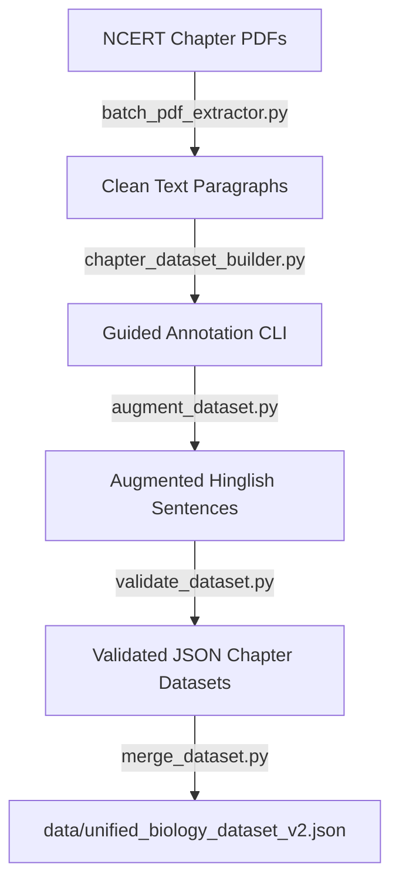
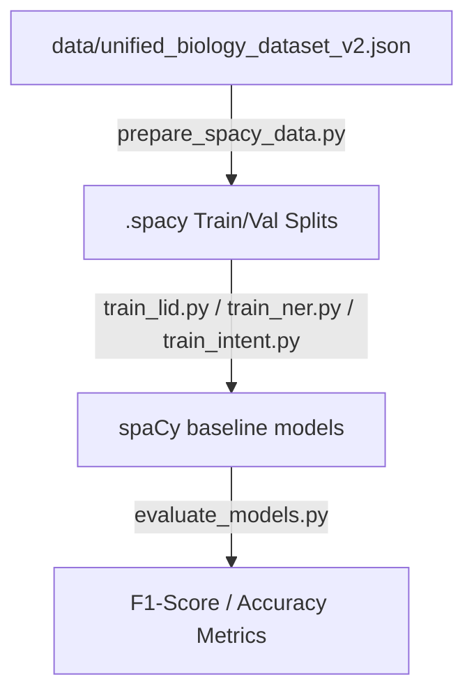
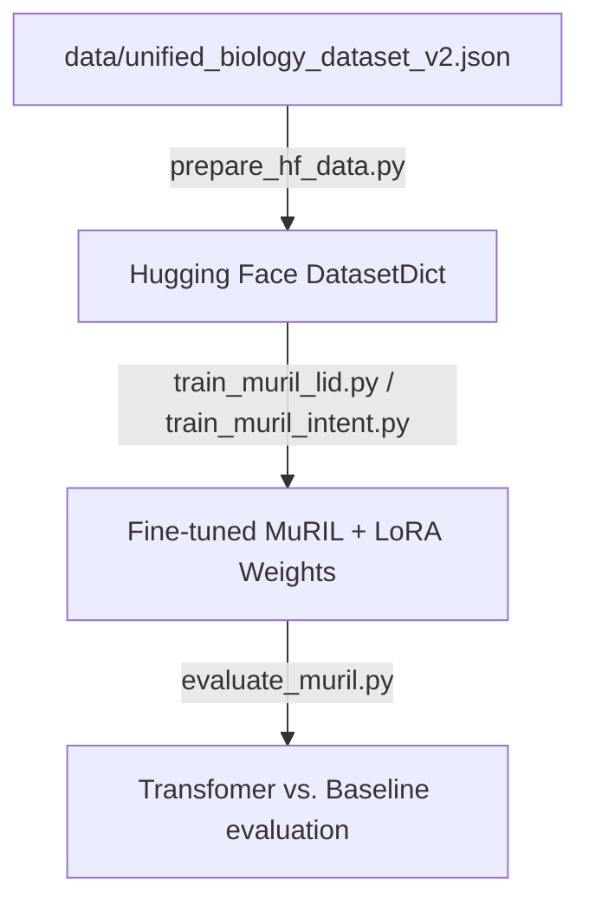
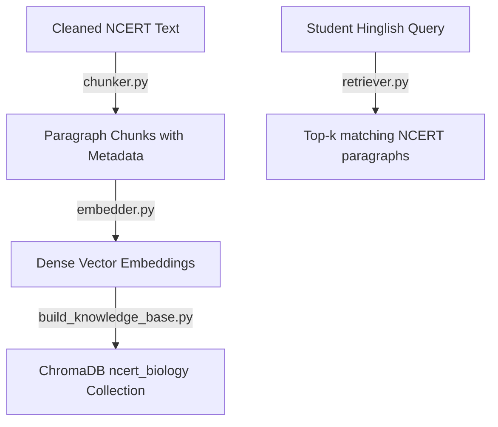
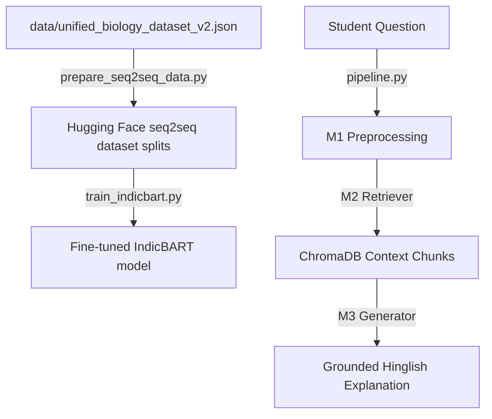

# EduHinglish Complete Guide: Phase Flows & Commands (Phases 1-6)

This document describes the architectural flow, input-to-output transitions, and the commands required to run and evaluate each phase of the EduHinglish project.

---

## Phase 1 & 2: Dataset Building, Expansion, and Validation

### 1. Architectural Flow


* **Input:** Raw NCERT PDF textbooks (`data/biology/`).
* **Processing:**
  1. PDF chapters are parsed into clean plain-text paragraphs.
  2. The annotation CLI guides manual translation of English sentences to Hinglish, with auto-suggested word-level tags (HI / EN / NE / UNIV).
  3. Sentences are augmented using synonym replacement, connector swapping, and structural variants to expand size.
  4. Validation checks formatting, ID uniqueness, and computes Code-Mixing Index (CMI) metrics.
  5. Merging combines individual chapters, cleans null entries, reorders IDs sequentially, and outputs the unified corpus.
* **Desired Output:** A cleaned, validated, unified dataset of 1,700 high-quality entries across 10 sections saved to `data/unified_biology_dataset_v2.json`.

### 2. Execution Commands

#### Step A: Raw NCERT Text Extraction
```bash
python scripts/batch_pdf_extractor.py
```
* **What it does:** Extracts clean text from NCERT PDFs and writes them to `data/processed/*/cleaned_text.txt`.

#### Step B: Rule-Based Dataset Augmentation
```bash
python scripts/augment_dataset.py
```
* **What it does:** Generates Hinglish variants of original sentences using rule-based connector and query swapping.

#### Step C: Interactive Annotation CLI
```bash
python scripts/chapter_dataset_builder.py --chapter class10/ch05
```
* **What it does:** Launches the command-line interface to translate sentences, predict labels, and label datasets.

#### Step D: Dataset Structure Validation
```bash
python scripts/validate_dataset.py
```
* **What it does:** Asserts JSON formatting, schema conformance, ID uniqueness, and reports CMI stats.

#### Step E: Compile & Merge All Datasets
```bash
python scripts/merge_dataset.py
```
* **What it does:** Merges individual dataset files, removes null elements, standardizes IDs sequentially, sorts all entries alphabetically, and outputs the final unified files.

#### Step F: Preprocessing Pipeline Test (M1 Only)
```bash
python src/pipeline.py
```
* **What it does:** Runs pipeline preprocessor tests to demonstrate script detection, normalization, and lexicon LID.

#### Step G: Automated Preprocessing Unit Tests
```bash
pytest tests/test_preprocessing.py
pytest tests/test_script_detector.py
```

---

## Phase 3: spaCy Baseline Model Training & Evaluation

### 1. Architectural Flow


* **Input:** `data/unified_biology_dataset_v2.json` (1,700 entries).
* **Processing:**
  1. The JSON dataset is converted into spaCy's native binary `.spacy` format.
  2. Tokens and labels are split into training (80%) and validation (20%) datasets.
  3. Three independent lightweight baseline models are trained on CPU: Language Identification (LID), Named Entity Recognition (NER), and intent classification.
* **Desired Output:** Trained baseline models saved in `models/` (`lid_v2/`, `ner_v2/`, `intent_v2/`) achieving 80%+ baseline classification accuracy.

### 2. Execution Commands

#### Step A: Prepare spaCy Training Data
```bash
python training/prepare_spacy_data.py
```
* **What it does:** Generates `.spacy` binary files from the unified dataset JSON file.

#### Step B: Train spaCy Baseline Models
```bash
python training/train_lid.py
python training/train_ner.py
python training/train_intent.py
```
* **What it does:** Trains baseline token classifiers, entity recognition networks, and intent text categorizers on CPU.

#### Step C: Evaluate spaCy Baselines
```bash
python training/evaluate_models.py
```
* **What it does:** Computes confusion matrices, precision, recall, and overall F1 accuracy scores for all spaCy baseline models.

#### Step D: Quick Interactive Model Testing
```bash
python training/test_models_quick.py --model all --text "Sir, chloroplast ka function kya hai?"
```
* **What it does:** Runs a CLI interface to evaluate spaCy baselines on arbitrary test text.

#### Step E: Direct Import Execution Check
```bash
python -c "
import spacy
nlp = spacy.load('models/lid_v2')
doc = nlp('Nucleus cell ka control centre hai')
for tok in doc:
    print(f'{tok.text:15} → {tok.tag_}')
"
```

---

## Phase 4: MuRIL Transformer Fine-Tuning & Evaluation

### 1. Architectural Flow


* **Input:** `data/unified_biology_dataset_v2.json` (1,700 entries).
* **Processing:**
  1. Dataset is converted into Hugging Face `DatasetDict` format.
  2. Fine-tuning uses Google's `google/muril-base-cased` pre-trained on Indian languages.
  3. Applies LoRA (Low-Rank Adaptation) via PEFT to limit trainable parameters to ~2M, optimizing for Colab T4.
* **Desired Output:** Fine-tuned token-level LID and sequence-level Intent models with 92%+ classification accuracy.

### 2. Execution Commands

#### Step A: Prepare Hugging Face Datasets
```bash
python training/prepare_hf_data.py
```
* **What it does:** Converts the unified dataset JSON into formatted, tokenized Hugging Face dataset directories.

#### Step B: Fine-Tune MuRIL Models (Colab/Local)
```bash
python training/train_muril_lid.py
python training/train_muril_intent.py
```
* **What it does:** Runs parameter-efficient LoRA training to fine-tune MuRIL for token-level LID and query intent classification.

#### Step C: Evaluate Transformer Performance
```bash
python training/evaluate_muril.py
```
* **What it does:** Evaluates MuRIL performance on the test partition and prints a comparison against Phase 3 spaCy baselines.

---

## Phase 5: NCERT Knowledge Base & Vector Retrieval (M2 Retriever)

### 1. Architectural Flow


* **Input:** Clean plain text files (`cleaned_text.txt`) of NCERT biology chapters.
* **Processing:**
  1. The text is parsed into paragraph chunks (~150-200 words) containing metadata.
  2. Embeddings are generated using `sentence-transformers/paraphrase-multilingual-MiniLM-L12-v2`.
  3. Vectors are indexed into local ChromaDB database files.
  4. The retriever computes cosine similarity between incoming query vectors and stored chunks.
* **Desired Output:** Local RAG database retrieving top-k NCERT reference paragraphs for any Hinglish input.

### 2. Execution Commands

#### Step A: Build ChromaDB Vector Database
```bash
python scripts/build_knowledge_base.py --force
```
* **What it does:** Creates/recreates the local ChromaDB store from chapter paragraphs and saves vector records.

#### Step B: Embedder Vector Mapping Test
```bash
python src/embedder.py
```
* **What it does:** Evaluates semantic similarity mapping for equivalent Hinglish/English terms to verify vector grouping.

#### Step C: Semantic Retrieval Query Test
```bash
python src/retriever.py
```
* **What it does:** Queries the database and outputs top-3 retrieved chunks.

#### Step D: Retriever Automated Unit Tests
```bash
pytest tests/test_retriever.py
```

---

## Phase 6: Generator (M3) & Unified QA Pipeline

### 1. Architectural Flow


* **Input:** Unified dataset JSON and student Hinglish questions.
* **Processing:**
  1. Unified dataset is split into training and validation sets for sequence-to-sequence learning.
  2. Formats inputs into Type A (Direct Translation), Type B (Query-Grounded), and Type C (Topic-Conditioned) prompts.
  3. Tokenizes text using the `ai4bharat/IndicBART` tokenizer.
  4. Fine-tunes IndicBART model on generative tasks.
  5. Integration combines M1 preprocessor, M2 ChromaDB retriever, and M3 generator.
* **Desired Output:** A grounded Hinglish response generator; pipeline taking questions and returning context-grounded Hinglish explanations.

### 2. Execution Commands

#### Step A: Prepare Seq2Seq Generative Splits
```bash
python training/prepare_seq2seq_data.py
```
* **What it does:** Filters short sentences, formats prompts (Types A/B/C), and writes the Hugging Face dataset to `training/data/indicbart_seq2seq_dataset/`.

#### Step B: Fine-Tune IndicBART Generative Model (Colab/Local)
```bash
python training/train_indicbart.py
```
* **What it does:** Trains IndicBART seq2seq transformer model to translate/respond.

#### Step C: Evaluate Generative Performance
```bash
python training/evaluate_generator.py
```
* **What it does:** Evaluates output translations against ground truth on test splits using BLEU, length ratios, and CMI delta.

#### Step D: Local Generator Inference Test
```bash
python src/generator.py
```
* **What it does:** Runs local inference on sample sentences to check generator post-processing.

#### Step E: Run Unified End-to-End QA Pipeline (M1 → M2 → M3)
```bash
python src/pipeline.py --query "Mitochondria ka cell mein kya function hota hai?"
```
* **What it does:** Passes query through preprocessor (M1), retrieves NCERT paragraphs (M2), and generates the final grounded Hinglish answer (M3).

---

## Complete Update Pipeline: What to run when you modify the dataset

If you make modifications to the raw dataset files or the annotations, you must run the following sequence of commands to ensure all processed data splits, baseline models, transformers, and generators are fully updated. 

### 1. Recompile the Unified Dataset
Run this to merge your updated chapter datasets into the final `data/unified_biology_dataset_v2.json`:
```bash
python scripts/merge_dataset.py
```

### 2. Re-prepare All Training Data Splits
Generate the updated training and validation splits for all downstream models:
```bash
python training/prepare_spacy_data.py
python training/prepare_hf_data.py
python training/prepare_seq2seq_data.py
```

### 3. Re-train Phase 3 Baselines (spaCy)
Train the lightweight CPU models on the new data splits:
```bash
python training/train_lid.py
python training/train_ner.py
python training/train_intent.py
```

### 4. Re-train Phase 4 Transformers (MuRIL)
Fine-tune the MuRIL transformers using the updated Hugging Face datasets:
```bash
python training/train_muril_lid.py
python training/train_muril_intent.py
```

### 5. Re-train Phase 6 Generator (IndicBART)
Fine-tune the sequence-to-sequence model on the updated seq2seq splits:
```bash
python training/train_indicbart.py
```

### 6. Rebuild Vector Database (Optional)
If your dataset changes involved adding or modifying the raw NCERT text corpus, you must also rebuild the ChromaDB knowledge base:
```bash
python scripts/build_knowledge_base.py --force
```
