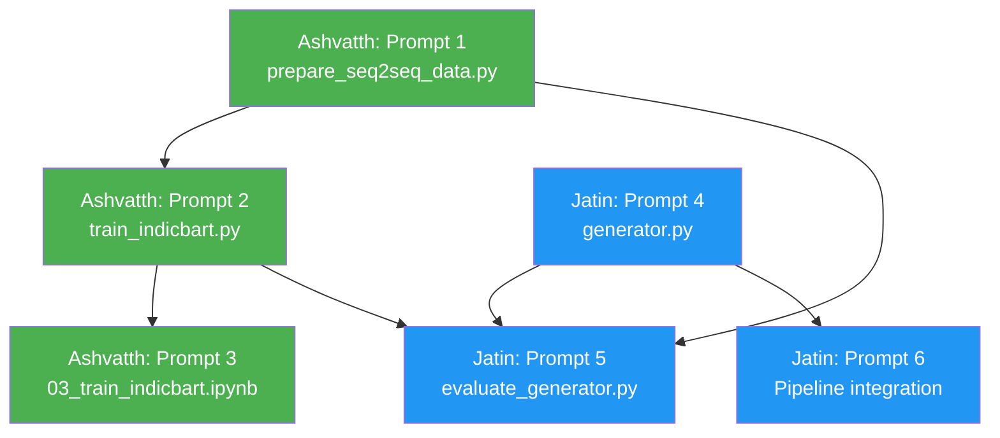

# Phase 6 — IndicBART Hinglish Generator Fine-tuning: Prompts

> **Goal:** Fine-tune IndicBART (ai4bharat/IndicBART, 244M params) to generate natural Hinglish explanations from NCERT English text. Runs on Colab T4.

> [!IMPORTANT]
> These prompts are **sequential** — Ashvatth's outputs feed into Jatin's work. Complete Ashvatth's Prompt 1 first, then both can work in parallel on the rest.

---

## Work Division Overview

| # | File | Owner | Depends On |
|---|------|-------|------------|
| 1 | `training/prepare_seq2seq_data.py` | **Ashvatth** | Dataset exists |
| 2 | `training/train_indicbart.py` | **Ashvatth** | Prompt 1 |
| 3 | `training/colab_notebooks/03_train_indicbart.ipynb` | **Ashvatth** | Prompt 2 |
| 4 | `src/generator.py` | **Jatin** | Model spec only |
| 5 | `training/evaluate_generator.py` | **Jatin** | Prompt 1 + Prompt 4 |
| 6 | Pipeline integration + `requirements.txt` | **Jatin** | Prompt 4 |

---

## Ashvatth — Prompt 1: Seq2Seq Data Preparation

```
Create the file training/prepare_seq2seq_data.py for EduHinglish Phase 6.

PURPOSE:
Convert our unified dataset into (source, target) pairs for IndicBART seq2seq fine-tuning.
- Source (input to model): NCERT English text (the original_english field)
- Target (model should learn to generate): Hinglish Roman explanation (the hinglish_roman field)

EXISTING CONTEXT YOU MUST FOLLOW:
- Dataset: data/unified_biology_dataset_v2.json — 950 entries across 10 NCERT chapters
- Each entry has this schema:
  {
    "id": "10_06_001",
    "original_english": "The food we eat provides energy...",
    "hinglish_roman": "Jo khana hum khate hain woh saare life processes ke liye energy deta hai.",
    "word_level_labels": { ... },
    "topic": "Life Processes - Introduction",
    "chapter": "Chapter 6: Life Processes",
    "class": "10",
    "code_mixing_type": "intra-sentential"
  }
- Some entries also have: is_student_query, intent, is_gec_sample, gec_data fields
- The codebase uses Python 3.10, HuggingFace transformers>=4.40.0, datasets>=2.19.0
- Follow the exact coding style of training/prepare_hf_data.py (same author):
  colorama output, thick/divider helpers, argparse CLI, split_train_dev with SEED=42,
  save as HuggingFace DatasetDict, save label_maps/config JSON alongside.

WHAT THIS SCRIPT MUST DO:

1. Load data/unified_biology_dataset_v2.json

2. Filter entries: keep only entries where BOTH original_english AND hinglish_roman are non-empty strings with at least 5 words each.

3. Build three types of (source, target) pairs:

   TYPE A — Direct Translation Pairs (all 950 entries):
   - source: "Translate to Hinglish: {original_english}"
   - target: "{hinglish_roman}"

   TYPE B — Query-Grounded Pairs (entries where is_student_query=True):
   - source: "Explain in Hinglish: {original_english} | Student asks: {hinglish_roman}"
   - target: "{hinglish_roman}"
   (This teaches the model to respond to student-style queries)

   TYPE C — Topic-Conditioned Pairs (all entries):
   - source: "Topic: {topic} | Explain in Hinglish: {original_english}"
   - target: "{hinglish_roman}"
   (This teaches topic awareness)

4. Tokenize all pairs using IndicBART tokenizer:
   - Model name: "ai4bharat/IndicBART"
   - Max source length: 256 tokens
   - Max target length: 256 tokens
   - Tokenize source with tokenizer(source_text, max_length=256, truncation=True, padding=False)
   - Tokenize target with tokenizer(target_text, max_length=256, truncation=True, padding=False)
   - Store: input_ids, attention_mask, labels (= target input_ids)

5. Split 80/20 train/dev using the same split_train_dev function pattern from prepare_hf_data.py (SEED=42)

6. Save as HuggingFace DatasetDict to training/data/indicbart_seq2seq_dataset/
   - Columns: input_ids, attention_mask, labels
   - Save a config JSON at training/data/indicbart_seq2seq_dataset/config.json with:
     {
       "model_name": "ai4bharat/IndicBART",
       "max_source_length": 256,
       "max_target_length": 256,
       "total_pairs": <count>,
       "type_a_count": <count>,
       "type_b_count": <count>,
       "type_c_count": <count>,
       "train_count": <count>,
       "dev_count": <count>
     }

7. Print detailed stats: total pairs, per-type counts, train/dev split sizes,
   avg source/target token lengths, sample source-target pairs (print 3 examples).

CLI:
  python training/prepare_seq2seq_data.py                    # all types
  python training/prepare_seq2seq_data.py --types A          # type A only
  python training/prepare_seq2seq_data.py --types A C        # types A and C
  python training/prepare_seq2seq_data.py --dataset PATH     # custom dataset path

Add proper docstring, author header matching the style of other training/ files.
Output directory: training/data/indicbart_seq2seq_dataset/
```

---

## Ashvatth — Prompt 2: IndicBART Fine-tuning Script

```
Create the file training/train_indicbart.py for EduHinglish Phase 6.

PURPOSE:
Fine-tune ai4bharat/IndicBART on our seq2seq (English→Hinglish) dataset using
HuggingFace Trainer with LoRA/PEFT. Must run on Google Colab T4 (16GB VRAM).

EXISTING CONTEXT:
- Dataset prepared by training/prepare_seq2seq_data.py → saved at:
  training/data/indicbart_seq2seq_dataset/ (HuggingFace DatasetDict with train/dev splits)
- Config JSON at: training/data/indicbart_seq2seq_dataset/config.json
- Model: ai4bharat/IndicBART (244M params, seq2seq / MBartForConditionalGeneration)
- The project already has LoRA fine-tuning in training/train_muril_lid.py and
  training/train_muril_intent.py — follow the same patterns:
  - PEFT/LoRA via peft>=0.10.0
  - HuggingFace Trainer (Seq2SeqTrainer for this case)
  - Colorama-styled output
  - argparse CLI with sensible defaults
  - Save model to models/indicbart_v1/
  - Save training logs
- Dependencies: transformers, peft, accelerate, datasets, torch, sentencepiece

WHAT THIS SCRIPT MUST DO:

1. Load the prepared dataset from training/data/indicbart_seq2seq_dataset/
   and the config JSON.

2. Load IndicBART model and tokenizer:
   - from transformers import MBartForConditionalGeneration, AutoTokenizer
   - model_name = "ai4bharat/IndicBART"
   - Load tokenizer with AutoTokenizer.from_pretrained(model_name)
   - Load model with MBartForConditionalGeneration.from_pretrained(model_name)

3. Apply LoRA using PEFT:
   - from peft import LoraConfig, get_peft_model, TaskType
   - LoRA config:
     task_type=TaskType.SEQ_2_SEQ_LM
     r=16
     lora_alpha=32
     lora_dropout=0.1
     target_modules=["q_proj", "v_proj"]  (attention projections)
   - Print trainable vs total parameters after applying LoRA

4. Set up Seq2SeqTrainer with Seq2SeqTrainingArguments:
   - output_dir="models/indicbart_v1"
   - num_train_epochs=5 (default, CLI overridable)
   - per_device_train_batch_size=8
   - per_device_eval_batch_size=8
   - gradient_accumulation_steps=2
   - learning_rate=3e-4
   - weight_decay=0.01
   - warmup_ratio=0.1
   - eval_strategy="epoch"
   - save_strategy="epoch"
   - save_total_limit=2
   - load_best_model_at_end=True
   - metric_for_best_model="eval_loss"
   - fp16=True (for T4 GPU)
   - predict_with_generate=True
   - generation_max_length=256
   - logging_steps=50
   - report_to="none"

5. Implement a custom data collator that pads input_ids, attention_mask,
   and labels to the longest sequence in the batch. Labels padding should
   use -100 (ignored by loss).

6. After training:
   - Save the LoRA adapter weights to models/indicbart_v1/
   - Save the tokenizer alongside
   - Save a training_summary.json with:
     epochs, final train_loss, final eval_loss, total training time,
     trainable_params, total_params, best_checkpoint_path
   - Print a final summary with colored output

7. Include a --test flag that, after training, generates Hinglish output
   for 5 sample English inputs from the dev set and prints them.

CLI:
  python training/train_indicbart.py                         # train with defaults
  python training/train_indicbart.py --epochs 3              # fewer epochs
  python training/train_indicbart.py --batch-size 4          # smaller batch for limited VRAM
  python training/train_indicbart.py --lr 5e-4               # custom learning rate
  python training/train_indicbart.py --test                  # generate samples after training
  python training/train_indicbart.py --resume models/indicbart_v1/checkpoint-XXX

Add proper docstring and author header. Follow the coding style of train_muril_lid.py.
```

---

## Ashvatth — Prompt 3: Colab Notebook

```
Create the file training/colab_notebooks/03_train_indicbart.ipynb for EduHinglish Phase 6.

PURPOSE:
A ready-to-run Google Colab notebook that performs the full IndicBART fine-tuning
pipeline on a free T4 GPU. This is the PRIMARY way the team will train the model.

EXISTING CONTEXT:
- We already have two Colab notebooks:
  training/colab_notebooks/01_train_muril_lid.ipynb
  training/colab_notebooks/02_train_muril_intent.ipynb
- Follow their structure and style exactly
- The notebook should reference and import from:
  training/prepare_seq2seq_data.py (Prompt 1)
  training/train_indicbart.py (Prompt 2)
- Model: ai4bharat/IndicBART, fine-tuned with LoRA/PEFT
- Dataset: data/unified_biology_dataset_v2.json (950 entries)

NOTEBOOK CELLS (in order):

Cell 1 — Title + Description (Markdown):
  # EduHinglish — Phase 6: IndicBART Hinglish Generator Fine-tuning
  Brief description, what this notebook does, expected runtime (~30-45 min on T4)

Cell 2 — GPU Check:
  !nvidia-smi
  import torch
  print(f"GPU: {torch.cuda.get_device_name(0)}")
  print(f"VRAM: {torch.cuda.get_device_properties(0).total_mem / 1e9:.1f} GB")

Cell 3 — Install Dependencies:
  !pip install -q transformers>=4.40.0 datasets>=2.19.0 peft>=0.10.0 \
    accelerate>=0.29.3 sentencepiece>=0.2.0 colorama>=0.4.6 \
    sentence-transformers>=2.7.0

Cell 4 — Clone repo or upload data:
  # Option A: Clone from GitHub
  !git clone https://github.com/PersuasivePost/EduHinglish.git
  %cd EduHinglish
  # Option B: Upload unified_biology_dataset_v2.json manually

Cell 5 — Verify dataset:
  import json
  with open("data/unified_biology_dataset_v2.json") as f:
      data = json.load(f)
  print(f"Dataset: {len(data)} entries")
  print(f"Sample: {data[0]['original_english'][:80]}...")
  print(f"Target: {data[0]['hinglish_roman'][:80]}...")

Cell 6 — Step 1: Prepare Seq2Seq Data (Markdown + Code):
  !python training/prepare_seq2seq_data.py

Cell 7 — Step 2: Train IndicBART with LoRA:
  !python training/train_indicbart.py --epochs 5 --test

Cell 8 — Step 3: Test Generation (interactive):
  Write a cell that loads the fine-tuned model from models/indicbart_v1/
  and generates Hinglish for custom English inputs:
  - Load base model + LoRA adapter
  - Define generate_hinglish(english_text) function
  - Test with 5 NCERT-style English sentences
  - Print source → generated Hinglish for each

Cell 9 — Step 4: Save model to Google Drive:
  from google.colab import drive
  drive.mount('/content/drive')
  !cp -r models/indicbart_v1 /content/drive/MyDrive/EduHinglish_models/

Cell 10 — Results Summary (Markdown):
  Table of training metrics, sample outputs, next steps

Make sure the notebook is self-contained and works end-to-end on Colab.
Use the same cell formatting style as the existing notebooks.
```

---

## Jatin — Prompt 4: Generator Inference Module

```
Create the file src/generator.py for EduHinglish Phase 6.

PURPOSE:
Inference module that loads the fine-tuned IndicBART model and generates
Hinglish explanations from English NCERT text + student queries. This is
the M3 module in the EduHinglish architecture.

EXISTING CONTEXT — READ THESE FILES FOR STYLE AND PATTERNS:
- src/embedder.py — follow the same class structure: __init__ with colorama status
  prints, clear docstrings, a main() CLI demo at the bottom
- src/retriever.py — follow the same error handling pattern (ImportError, missing files)
- src/pipeline.py — this generator will be called by the pipeline
- src/chunker.py — follow the same project path resolution pattern
- The model will be saved at models/indicbart_v1/ (LoRA adapter weights)
  OR the full base model can be used without fine-tuning as a fallback

WHAT THIS MODULE MUST CONTAIN:

class HinglishGenerator:
    """
    M3 — Hinglish Answer Generator
    Loads fine-tuned IndicBART and generates Hinglish explanations
    from NCERT English text.
    """

    def __init__(self, model_path="models/indicbart_v1",
                 base_model="ai4bharat/IndicBART",
                 device=None, use_lora=True):
        """
        Load model + tokenizer.
        - If use_lora=True and model_path exists: load base model + LoRA adapter
        - If use_lora=True but model_path doesn't exist: print warning, load base model
        - If use_lora=False: load base model only (no fine-tuning)
        - device: auto-detect (cuda if available, else cpu)

        Print initialization status with colorama (matching embedder.py style):
          [OK] HinglishGenerator initialized
               Model: IndicBART + LoRA (or IndicBART base)
               Device: cuda / cpu
               LoRA adapter: loaded / not found (using base)
        """

    def generate(self, english_text, max_length=256, num_beams=4,
                 temperature=0.7, top_p=0.9, do_sample=True,
                 prefix="Translate to Hinglish: "):
        """
        Generate Hinglish explanation from English input.

        Args:
            english_text: NCERT English paragraph or sentence
            max_length: Maximum generation length in tokens
            num_beams: Beam search width (4 is good default)
            temperature: Sampling temperature (lower = more conservative)
            top_p: Nucleus sampling threshold
            do_sample: Whether to use sampling (False = greedy/beam search)
            prefix: Task prefix prepended to input (matches training format)

        Returns:
            dict with keys:
              - "input": original English text
              - "output": generated Hinglish text
              - "generation_config": dict of all generation parameters used
        """

    def generate_answer(self, query, retrieved_chunks, max_length=256):
        """
        Generate a Hinglish answer given a student query and retrieved NCERT chunks.
        This is the PRIMARY method used in the full pipeline (M1→M2→M3).

        Args:
            query: Student's question (could be Hinglish or English)
            retrieved_chunks: List of chunk dicts from NCERTRetriever.search()
                              Each has: text, metadata, relevance_score

        Process:
            1. Combine top retrieved chunks into context (first 2-3 chunks,
               limited to ~400 words total)
            2. Build prompt: "Topic: {chapter_title} | Context: {context} |
               Student asks: {query} | Explain in Hinglish:"
            3. Generate using self.generate()

        Returns:
            dict with keys:
              - "query": original student query
              - "context_used": the combined chunk text
              - "context_sources": list of (chapter_title, chunk_id, relevance_score)
              - "hinglish_answer": generated Hinglish text
              - "generation_config": generation parameters
        """

    def generate_batch(self, english_texts, batch_size=8, **kwargs):
        """
        Batch generation for evaluation. Generates for multiple inputs at once.

        Args:
            english_texts: List of English strings
            batch_size: Number to process at once

        Returns:
            List of output dicts (same format as generate())
        """


# CLI — Quick test
def main():
    """
    Load generator and test with sample NCERT sentences.
    Test both generate() and generate_answer() methods.
    """
    Test sentences:
    1. "Photosynthesis is the process by which green plants make food using sunlight."
    2. "The nucleus contains chromosomes which carry genetic information."
    3. "Respiration involves breaking down of glucose to release energy."
    4. "Stomata are tiny pores on leaves that allow gas exchange."
    5. "DNA replication is the process of making an identical copy of DNA."

    For generate_answer() test, create mock retrieved chunks:
    [{"text": "Photosynthesis occurs in chloroplasts...",
      "metadata": {"chapter_title": "Life Processes"}, "relevance_score": 0.85}]

    Print each input and its generated Hinglish output with colorama formatting.

if __name__ == "__main__":
    main()
```

---

## Jatin — Prompt 5: Generator Evaluation Script

```
Create the file training/evaluate_generator.py for EduHinglish Phase 6.

PURPOSE:
Evaluate the fine-tuned IndicBART generator quality using automated metrics
and human-readable sample outputs. This lets us compare:
- Base IndicBART vs fine-tuned IndicBART
- Different training configurations
- Quality across chapters/topics

EXISTING CONTEXT:
- training/evaluate_models.py already exists (for spaCy models) — follow its style
- training/evaluate_muril.py already exists (for MuRIL) — follow its style
- Dataset: data/unified_biology_dataset_v2.json
- Generator: src/generator.py (Prompt 4)
- The project uses colorama for terminal output

WHAT THIS SCRIPT MUST DO:

1. Load the dev split from training/data/indicbart_seq2seq_dataset/
   (or load full dataset and recreate the split with SEED=42)

2. Load the generator (src/generator.py → HinglishGenerator class)
   with the fine-tuned model from models/indicbart_v1/

3. Generate Hinglish for all dev set entries

4. Compute these metrics (comparing generated vs reference hinglish_roman):

   a) BLEU Score:
      - Use sacrebleu or nltk.translate.bleu_score
      - Compute corpus-level BLEU and per-sentence BLEU

   b) ROUGE Scores (ROUGE-1, ROUGE-2, ROUGE-L):
      - Use rouge-score library
      - These measure n-gram overlap

   c) Code-Mixing Index (CMI):
      - Reuse the CMI calculation logic from scripts/validate_dataset.py
        or src/script_detector.py (WordLevelLID)
      - Compute CMI of generated text — it should be similar to reference
        (40-60% range indicates good Hinglish mixing)
      - Report: avg CMI of reference vs avg CMI of generated

   d) Length Ratio:
      - avg(len(generated)) / avg(len(reference))
      - Should be close to 1.0 (0.8-1.2 is acceptable)

5. Print a detailed evaluation report:
   - Overall metrics table
   - Per-chapter breakdown (group by chapter field)
   - 10 sample outputs showing:
     English input → Reference Hinglish → Generated Hinglish
   - Worst 5 examples (lowest BLEU) for error analysis

6. Save results to outputs/generator_eval_results.json with all metrics
   and per-example scores

CLI:
  python training/evaluate_generator.py                      # full evaluation
  python training/evaluate_generator.py --samples 20         # show 20 samples
  python training/evaluate_generator.py --model models/indicbart_v1  # custom model path
  python training/evaluate_generator.py --compare-base       # also evaluate base model (no LoRA)

Add proper docstring and author header matching existing training/ scripts.
```

---

## Jatin — Prompt 6: Pipeline Integration + Requirements Update

```
Modify two existing files for EduHinglish Phase 6 pipeline integration.

PURPOSE:
Integrate the HinglishGenerator (M3) into the existing pipeline so we have
a working M1→M2→M3 flow: Input Processing → NCERT Retrieval → Hinglish Generation.

===== FILE 1: src/pipeline.py (MODIFY) =====

CURRENT STATE:
- EduHinglishPipeline class handles M1 (preprocessing) only
- Has process(), process_english(), process_hinglish(), compare() methods
- Imports: EnglishPreprocessor, ScriptDetector, HinglishNormalizer, WordLevelLID

CHANGES NEEDED:

1. Add imports at the top (after existing imports):
   from embedder import NCERTEmbedder
   from retriever import NCERTRetriever
   from generator import HinglishGenerator

2. Add an __init__ parameter to control which modules to load:
   def __init__(self, mode="preprocess"):
       """
       Args:
           mode: "preprocess" — M1 only (current behavior, lightweight)
                 "full"       — M1 + M2 + M3 (loads embedder, retriever, generator)
       """
   - In "preprocess" mode: load only existing M1 modules (current behavior)
   - In "full" mode: also load NCERTEmbedder, NCERTRetriever, HinglishGenerator

3. Add a new method:
   def answer_query(self, query: str) -> dict:
       """
       Full pipeline: student query → preprocessing → retrieval → generation.
       Only available in mode="full".

       Steps:
         1. M1: Run process() to detect language, normalize, extract key terms
         2. M2: Use retriever.search(query, embedder, top_k=3) to find relevant chunks
         3. M3: Use generator.generate_answer(query, retrieved_chunks) to generate answer

       Returns:
           dict with keys:
             - "query": original query
             - "preprocessing": M1 output (script detection, LID, normalization)
             - "retrieval": list of retrieved chunk summaries (text preview, chapter, score)
             - "generation": generated Hinglish answer
             - "pipeline_trace": ordered list of step names + timings
       """

4. Update the CLI/main() to add a --query flag:
   python src/pipeline.py --query "Mitochondria ka kaam kya hai?"
   → runs the full answer_query pipeline and prints step-by-step results

5. DO NOT modify any existing methods or their behavior. The existing
   process(), process_english(), process_hinglish(), compare() methods
   must continue to work exactly as before.

===== FILE 2: requirements.txt (MODIFY) =====

Add a new section at the bottom:

# --- Phase 6: IndicBART Hinglish Generator ---
# rouge-score>=0.1.2          # for generator evaluation
# sacrebleu>=2.4.0            # for BLEU score computation
# (IndicBART uses sentencepiece which is already in Phase 4 deps)

Note: Keep rouge-score and sacrebleu commented out like the other optional deps
at the top of the file. The core IndicBART deps (transformers, peft, sentencepiece)
are already listed under Phase 4.

Follow the existing code style exactly. Use colorama for status output.
All existing tests must still pass.
```

---

## Execution Order



> [!TIP]
> **Parallel work is possible:** Jatin can start Prompt 4 (`generator.py`) immediately — it only needs the model name/path convention, not the actual trained model. Ashvatth's Prompt 1 (`prepare_seq2seq_data.py`) should be done first since Prompts 2, 3, and 5 depend on it.

---

## Verification Checklist

After completing all prompts, verify:

- [ ] `python training/prepare_seq2seq_data.py` runs and creates dataset in `training/data/indicbart_seq2seq_dataset/`
- [ ] `python training/train_indicbart.py --epochs 1 --test` runs (at least starts training) on a GPU machine
- [ ] `python src/generator.py` loads the model and generates sample outputs
- [ ] `python training/evaluate_generator.py --samples 5` produces BLEU/ROUGE/CMI metrics
- [ ] `python src/pipeline.py --query "Photosynthesis kya hai?"` runs the full M1→M2→M3 pipeline
- [ ] `python src/pipeline.py` (existing demos) still works without loading M2/M3
- [ ] The Colab notebook `03_train_indicbart.ipynb` can run end-to-end on a free T4
